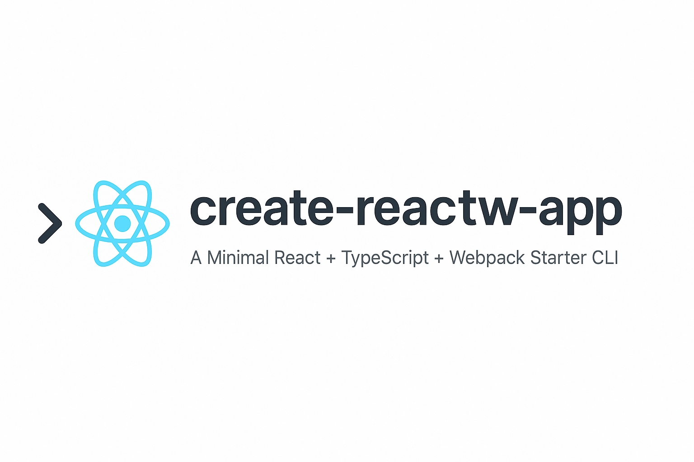
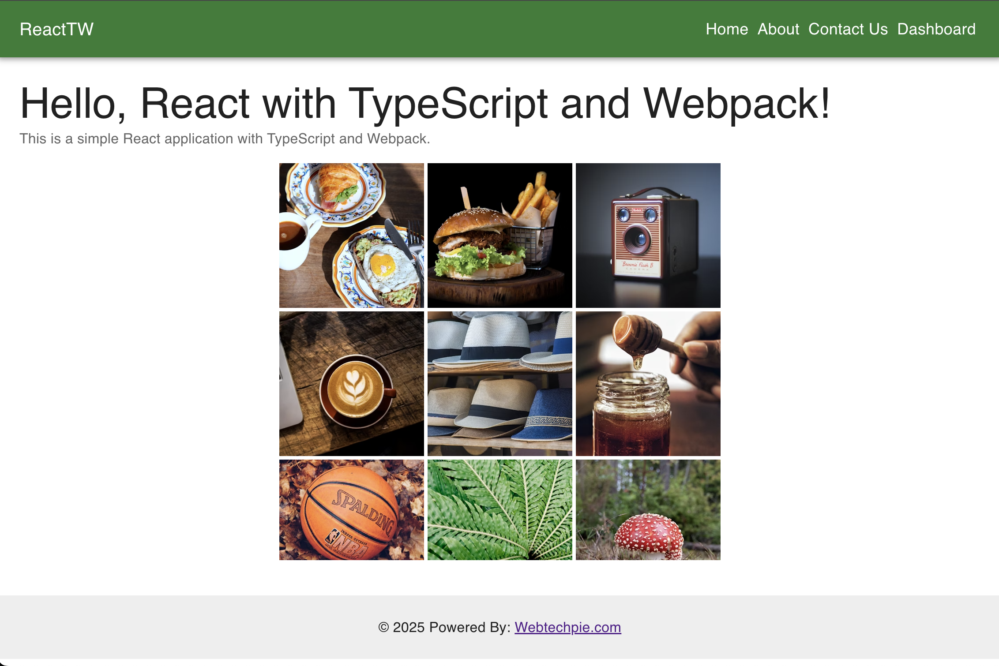

# template-rtw (`create-reactw-app`)

React Typescript Webpack (RTW) is a starter template for building React applications with TypeScript and Webpack.



template-rtw AKA `create-reactw-app` is a minimal boilerplate to kickstart React projects using TypeScript + Webpack + Babel + ESLint + Prettier.

> Supports HMR and is easy to extend.

[](https://github.com/hidaytrahman/template-react-ts-webpack)

## 🚀 Quick Start with npx - (Recommended)

You can scaffold a fresh project using this template via the CLI:

```bash
npx create-reactw-app my-app
cd my-app
yarn start
```


## Getting Started with Manual approach

### Prerequisite

- Node 22 (LTS)
- Yarn

This template is designed to be used as a starting point for building React applications with TypeScript and Webpack

[Create a new repo with the template](https://github.com/new?template_name=template-react-ts-webpack&template_owner=hidaytrahman)

1. **Generate a new repository** from this template by clicking the "Use this template" button.
2. Clone the new repository to your local machine:

   ```shell
   $ git clone https://github.com/hidaytrahman/your-repo.git
   ```

   ```shell
   $ cd your-repo
   ```

   ### Install

   You can either execute the scripts/start.sh script directly or run the commands listed below manually.

   ```shell
   $ yarn install
   ```

   ### Run

   ```shell
   $ yarn start
   ```

   Access: http://localhost:3000/

   

   ### Build

   ```
   yarn build
   ```

### Structure

```
project-root/
    ├── 📁 coverage/
    ├── 📁 public/
    ├── 📁 scripts/
    ├── 📁 src/
    ├── 📄 BEST_PRACTICES.md
    ├── 📄 eslint.config.js
    ├── 📄 jest.config.js
    ├── 📄 jest.setup.js
    ├── 📄 LICENSE
    ├── 📄 package.json
    ├── 📄 README.md
    ├── 📄 tsconfig.json
    ├── 📄 webpack.common.js
    ├── 📄 webpack.config.js
    ├── 📄 webpack.dev.js
    ├── 📄 webpack.prod.js
    └── 📄 yarn.lock

```

### 🧰 What’s Inside

- ⚛️ React 18
- ⛓ TypeScript
- 📦 Webpack 5
- 🔥 HMR
- 🧹 ESLint + Prettier
- 🎯 Babel
- 🧪 Jest (if you add it)

### Why Use `create-reactw-app`?

**No More Boilerplate**: Skip the tedious setup process and jump straight into coding.

**Fully Customizable**: While it works out of the box, you can easily tweak the Webpack configuration or add new tools as needed.

**Modern Stack**: Built with the latest versions of React, TypeScript, and Webpack to ensure your project is future-proof.

**Community-Driven**: Open-source and open to contributions. Feel free to suggest improvements or report issues!

### Who Is This For?

**Beginners**: If you’re new to React or TypeScript, this template provides a clean and well-documented starting point.

**Experienced Developers**: If you’re tired of setting up the same configuration repeatedly, this template will save you time and effort.

**Teams**: Standardize your project setup across your team with a consistent and reliable template.

## Features

- Boilerplate for the react with webpack
- React 19
- TypeScript 5
- Webpack 5
- MUI 6
- Mock implementation with MSW
- React Router v7 - Integrated
- Services Integrated with Axios
- Development server with hot reloading
- Production-ready build configuration

## Test Coverage & Branch Thresholds

- This template aims for **90%+ test coverage** globally for branches, functions, lines, and statements.
- For some files (such as service files with implicit returns or unreachable branches), 100% branch coverage is not always achievable or meaningful. In these cases, the branch threshold is slightly lowered in the Jest configuration for those files.
- All meaningful logic and error paths are covered by tests, even if the coverage tool reports less than 100% for certain files.

### Contibutions

Feel free to fork, star, or contribute to the project. If you have any feedback or suggestions, I’d love to hear from you! Let’s build something amazing together.

## Final Thoughts

The deprecation of CRA has left a void in the React ecosystem, but it also opens the door for better, more flexible solutions. template-rtw is my attempt to fill that void and provide developers with a modern, customizable, and production-ready alternative.

Give it a try, and let me know what you think! Happy coding! 🚀

## ⭐ Related Projects

- [Chepo](https://github.com/hidaytrahman/chepo) - Easiest way to get mock data
- [preapi](https://github.com/hidaytrahman/preapi) - A very simple API prototype file based database
- `create-reactw-app` – CLI to bootstrap this template via npx
